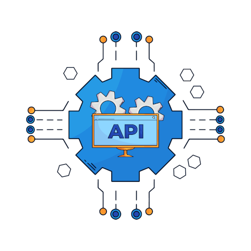

# groupie-tracker

<!-- PROJECT LOGO -->
<br />
<div align="center">
  <a href="https://gitea.com/almadhoob/groupie-tracker">
    
  </a>

<h3 align="center">Groupie Tracker</h3>

  <p align="center">
    A simple web app for groupie tracking.
    <br />
    <a href="https://gitea.com/almadhoob/groupie-tracker"><strong>Go to the repo »</strong></a>
    <br />
    <br />
    <a href="https://gitea.com/almadhoob/groupie-tracker/issues/new?labels=bug&template=bug-report---.md">Report Bug</a>
    ·
    <a href="https://gitea.com/almadhoob/groupie-tracker/issues/new?labels=enhancement&template=feature-request---.md">Request Feature</a>
  </p>
</div>

<!-- TABLE OF CONTENTS -->
<details>
  <summary>Table of Contents</summary>
  <ol>
    <li>
      <a href="#about-the-project">About The Project</a>
      <ul>
        <li><a href="#built-with">Built With</a></li>
      </ul>
    </li>
    <li>
      <a href="#getting-started">Getting Started</a>
      <ul>
        <li><a href="#prerequisites">Prerequisites</a></li>
        <li><a href="#installation">Installation</a></li>
      </ul>
    </li>
    <li><a href="#usage">Usage</a></li>
    <li><a href="#contributing">Contributing</a></li>
    <li><a href="#authors">Authors</a></li>
    <li><a href="#acknowledgments">Acknowledgments</a></li>
    <li><a href="#license">License</a></li>
  </ol>
</details>

<!-- ABOUT THE PROJECT -->

## About The Project

<!-- <div align="center"></div> -->
<!-- <br /> -->

The groupie-tracker is a program that is written in Go language using its standard library for the backend (net/http) and the frontend (html/template) to be excuted as a web server with a web page. It consumes the [Groupie Trackers API](https://groupietrackers.herokuapp.com/api), getting four data structures: `artists`, `locations`, `dates`, and `relation`. After that, the program manipulates the data and displays the information on a simple user-friendly web portal with several data visualizations (for example: blocks, cards, tables, list, pages, graphics, etc.)

<p align="right">(<a href="#groupie-tracker">back to top</a>)</p>

### Built With

- [Go programming language](https://go.dev/doc/)
- [Go HTML templates](https://pkg.go.dev/html/template/)
- [JSON file format](https://www.json.org/json-en.html/)

<p align="right">(<a href="#groupie-tracker">back to top</a>)</p>

<!-- GETTING STARTED -->

## Getting Started

To get a local copy up and running follow these simple steps.

### Prerequisites

You only need a web browser (such as Mozilla Firefox) besides the following software:

- Go programming language (v1.22.4 or newer)
  ```sh
  go version
  ```

### Installation

1. Clone the repo

   ```sh
   git clone https://gitea.com/almadhoob/groupie-tracker.git
   cd groupie-tracker
   ```

2. Build the app

   ```sh
   go build -o app.run
   chmod +x app.run
   ```

3. Run the app
   ```sh
   ./app.run
   ```

<p align="right">(<a href="#groupie-tracker">back to top</a>)</p>

<!-- USAGE EXAMPLES -->

## Usage

Open the web page through: [http://localhost:8080](http://127.0.0.1:8080)

<p align="right">(<a href="#groupie-tracker">back to top</a>)</p>

<!-- CONTRIBUTING -->

## Contributing

Contributions are what make the open source community such an amazing place to learn, inspire, and create. Any contributions you make are **greatly appreciated**.

If you have a suggestion that would make this better, please fork the repo and create a pull request. You can also simply open an issue with the tag "enhancement".

1. Fork the Project
2. Create your Feature Branch (git checkout -b feature/AmazingFeature)
3. Commit your Changes (git commit -m 'Added some AmazingFeature')
4. Push to the Branch (git push origin feature/AmazingFeature)
5. Open a Pull Request

Don't forget to give the project a star! Thanks again!

<p align="right">(<a href="#groupie-tracker">back to top</a>)</p>

<!-- AUTHORS -->

## Authors

- Ayoob Aloribi — [GitHub](https://github.com/aloribi)[LinkedIn](https://bh.linkedin.com/in/ayoob-aloribi/)
- Ahmed Almadhoob — [GitHub](https://github.com/almadhoob)[LinkedIn](https://bh.linkedin.com/in/almadhoob/)

<p align="right">(<a href="#groupie-tracker">back to top</a>)</p>

<!-- ACKNOWLEDGMENTS -->

## Acknowledgments

- Yaman Al-Masri
- Ahmed Abdeen

<p align="right">(<a href="#groupie-tracker">back to top</a>)</p>

<!-- LICENSE -->

## License

This is an [MIT-Licensed](./LICENSE) project which is created by its authors for [Reboot01](https://reboot01.com/).

<p align="right">(<a href="#groupie-tracker">back to top</a>)</p>
